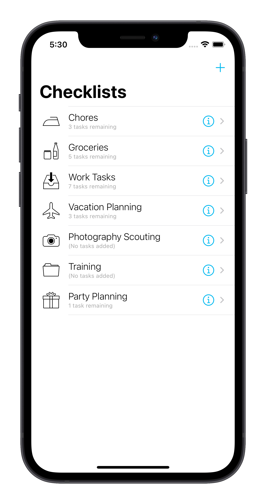
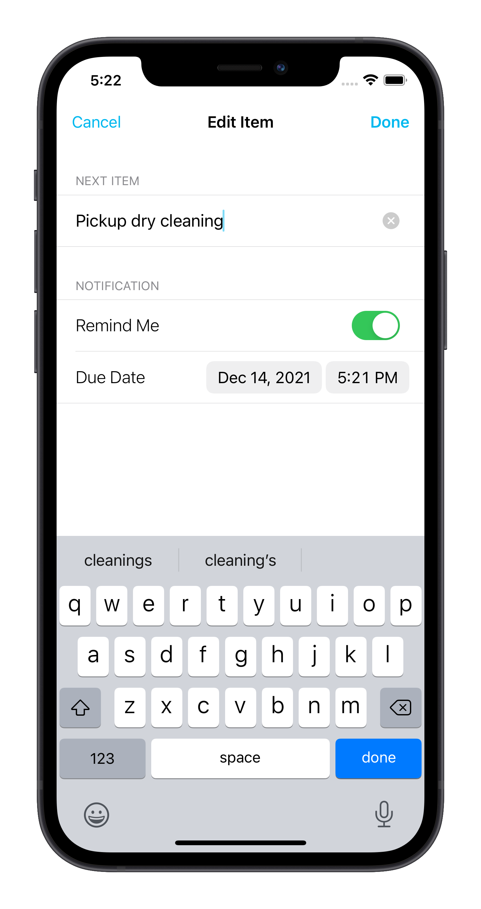
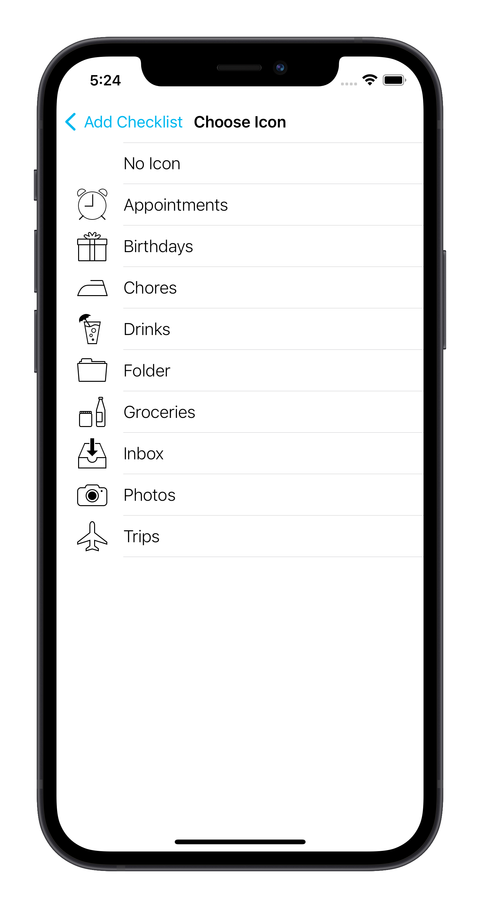
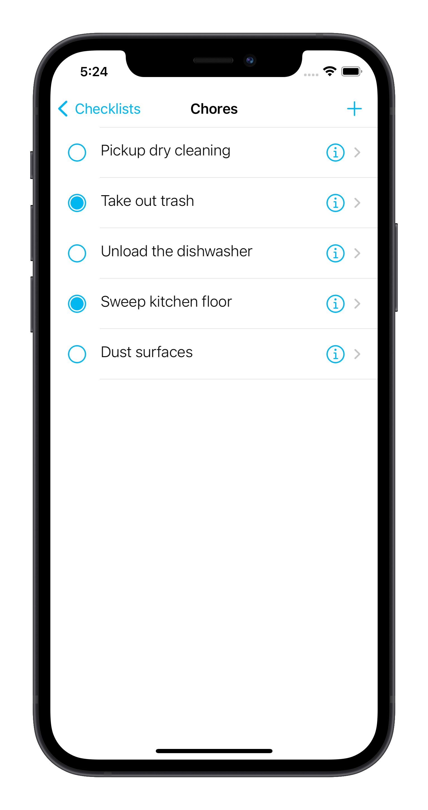

# Compleat - A todo-list iOS app

## Description

`Compleat` is a simple and intuitive todo list app designed to simplify your tasks.

With Compleat, you can easily create and manage your daily tasks, set reminders, and prioritize your work. Compleat is built using the latest technologies and frameworks, including UserNotifications, UIKit, and persisting data with a plist file.

## Technologies

Compleat is built using the following technologies:

* `UIKit` for designing the app's interface and user experience.
* `User Notifications` for scheduling and sending notifications to the user when a task is due.
* `Data Persistance` serializing user data to Plist files
* `UserDefaults` to remember last open list

## Features

* Create and manage your daily tasks
* Set reminders and notifications for your tasks
* Prioritize your work with custom categories and tags
* Mark tasks as complete and track your progress
* Easy-to-use interface with smooth animations and transitions

## Challenges

* Designing an intuitive user interface for creating, editing, and completing tasks
* Implementing data persistence to store tasks across multiple app launches
* Handling edge cases such as incomplete or missing task data
* Implementing reminders and notifications for upcoming tasks and deadlines
* Enabling sorting and filtering of tasks by priority, due date, or other criteria

## Skills Gained

Developing this todo list app helped solidify a variety of iOS skills, including:

* `User Interface Design` Creating an intuitive and visually appealing interface that allows users to interact with tasks and task lists effectively.
* `Data Persistence` Using a variety of techniques to store task data locally on the device, such as using Core Data, a plist file, or other data storage technologies.
* `Notifications and Reminders` Implementing local notifications and reminders to help users keep track of upcoming tasks and deadlines.
* `Handling User Input` Capturing user input accurately and reliably and handling any errors or edge cases that may arise.
* `App Navigation` Creating an intuitive and user-friendly navigation structure that allows users to move easily between task lists and individual tasks.
  
These skills are valuable for any iOS developer and can be applied to a wide range of projects beyond just a todo list app.

## Screenshots

Home | Add Item | Choose Icon | Edit Item
:-: | :-: | :-: | :-: |
|  |  |  |  |

## Swift and Xcode Versions

This project is built with `Swift 5.1` and `Xcode 13`

## About Me

I'm an iOS Developer | UX Designer. You can connect with me on [Twitter](https://twitter.com/richiexflores)

Follow my thought process on [Medium](blog.richie.flores.com).
